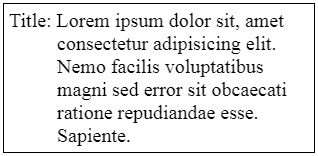

# WorkNote

- 文字第二行縮排效果

  類似這樣的效果

  

  

  ```css
  margin-left: 48px;
  text-indent: -48px;
  ```

---

- 文字閃爍效果 TEXT SHINE

  ```scss
  .shine {
      background-image: linear-gradient(90deg, $default_color 25%, #83D1F3 37.5%, #83D1F3, #83D1F3 62.5%, white 75%);
      background-position: right center;
      background-size: 400% auto;
      -webkit-background-clip: text;
      background-clip: text;
      -webkit-text-fill-color: transparent;
      text-fill-color: transparent;
      transition: color 200ms linear;
      &:hover{
          background-position: left center;
          transition: background-position 0.7s ease-out;    
      }
  }
  ```

---

- 按鈕閃爍效果 BUTTON SHINE

  ```scss
  .btn-find{
      margin: 0 auto;
      margin-top: 45px;
      display: block;
      height: 40px;
      width: 60%;
      max-width: 611px;
      font-size: 1.3rem;
      border-radius: 50px;
      border: none;
      color: $default_color;
      background: linear-gradient(90deg, #694DE2 20%, #8AC6F2  80%); 
      cursor: pointer;
      position: relative;
      outline: none;
      overflow: hidden;
      &:after{
          content: '';
          position: absolute;
          width: 200px;
          height: 500px;
          top: -400px;
          left: -200px;
          background: linear-gradient(
              to right, 
              rgba(255, 255, 255, 0.1) 0%,
              rgba(255, 255, 255, 0.1) 77%,
              rgba(255, 255, 255, 0.5) 92%,
              rgba(255, 255, 255, 0.0) 100%);
          transform: rotate(20deg);
          opacity: 0;
      }
      &:hover::after{
          left: 550px;
          top: 0;
          opacity: 1;
          transition: all .7s ease;
      }
  }
  ```

---

- 判斷 checkbox/ radio 是否有勾選 ( jQuery)

  ```javascript
  if( $('input[name="xxx"]:checked').length == 0)
  	//Do something
  ```

---

- 複製到剪貼簿效果

  - html

    ```html
    <!DOCTYPE html>
    <html>
    <head>
    <meta name="viewport" content="width=device-width, initial-scale=1">
    </head>
    <body style="text-align:center">
    <div class="popup_msg">
        <span class="arrow_in"></span>
        <span class="arrow_out"></span>已复制内容
    </div>
    </body>
    </html>
    ```

    

  - CSS

    ```css
    .popup_msg{
        width:100px;
        height:20px;
        text-align:center;
        background:#fff;
        position:relative;
        border: solid 1px #333;
        border-radius: 5px;
        margin:30px;
        padding:10px;
    }
    
    /* /箭頭下/ */
    .popup_msg .arrow_in{
        width:0px;
        height:0px;
        border-width:8px;
        border-style:solid;
        border-color:#000 transparent transparent transparent ;
        position:absolute;
        bottom:-17px;
        right:50px;
    }
    /* /箭頭下-邊框/ */
    .popup_msg .arrow_out{
        width:0px;
        height:0px;
        border-width:8px;
        border-style:solid;
        border-color:#fff transparent transparent transparent ;
        position:absolute;
        bottom:-16px;
        right:50px;
    }
    ```

    

  - jQuery

    ```javascript
    $('.email a').on('click',function(){
    var tempObj = $('<input>'); // 建立input物件 
        $('body').append(tempObj); // 將input物件增加到body
    	var address = $(this).data('mail'); // 取得要複製的連結
        tempObj.val(address).select(); // 將連結加到input物件value
        document.execCommand('copy'); // 複製
        tempObj.remove(); // 移除input物件
    })
    ```

  - 呈現效果

    

---

- **tab highlight area**

  在行動裝置上會出現的問題
  當image 用 \<a> 包起來之後，在 iPhone/iPad 上按下image時，周圍會有一塊 highlight 的區域

  

  解決方式:

  在 <a> 的 css 加上 **`-webkit-tap-highlight-color: transparent;`**
  可以讓 highlight 區域的顏色透明

---

- **Video preview**

  - 方法1

    在src 後面加上#t=0.1 抓取0.1秒左右畫面

    ```html
    <video width="320" height="240" controls>
      <source src="video.mp4#t=0.1" type="video/mp4">
    </video>
    ```

  - 方法2

    加入 poster 屬性

    ```html
    <video id="player" poster="http://site.com/img.jpg" controls>
        <source src="/media/video.webm" type="video/webm">
        <source src="/media/video.mp4" type="video/mp4">
    </video>
    ```

---

- npm run watch failed

  

  問題原因: node.js 版本太舊，原本為4.0+

  解決方法: 更改為 8.0+

---

- HTTP 500 error

  DNS出問題

---

- 區塊淡入偏移動畫

  - html

    ```html
    <div class="">This box</div>
    ```

  - scss

    ```scss
    .animatable{
    	visibility: hidden;
    }
    .animated{
        visibility: visible;
    	&.fadeInUp{
    		animation: fadeInUp 0.7s;
    	}
    }
    
    @keyframes fadeInUp {
        0% {
            opacity: 0;
            transform: translateY(80px);
        }
        100% {
            opacity: 1;
            transform: translateY(0);
        }
    }
    ```

  - jQuery

    ```javascript
    // 頁面內容淡入動畫
    $( document ).ready(){
        let doAnimation = function(){
            if($('.animatable').length == 0) {
        	    $(window).off('scroll', doAnimation);
    	    }
            let bottom_of_window = $(window).scrollTop() + $(window).height();
            $('.animatable').each(function(){
                let top_of_element = $(this).offset().top;
                if(bottom_of_window > top_of_element){
                    $(this).removeClass('animatable').addClass('animated');
                }
            });
        };
    
        doAnimation();
        $(window).on('scroll', doAnimation);
    }
    ```

    

